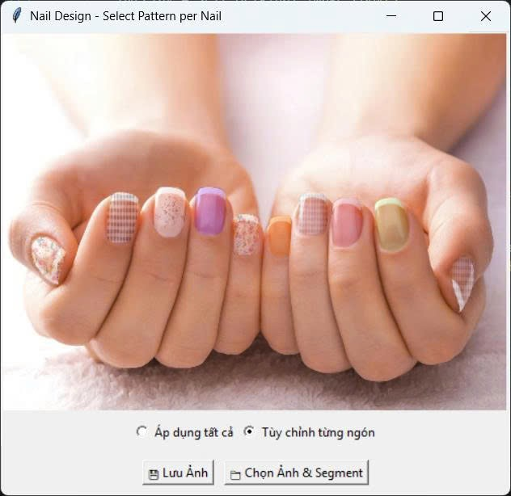

# Nail Segmentation & Coloring

Ứng dụng này cho phép bạn chọn ảnh bàn tay, tự động phân vùng (segment) các móng tay bằng AI, sau đó chọn màu và điều chỉnh độ trong suốt để tô màu móng tay ngay trên ảnh.

## Tính năng

- Chọn ảnh từ máy tính.
- Segment móng tay tự động bằng AI (Roboflow).
- Chọn màu móng tuỳ ý.
- Điều chỉnh độ trong suốt (alpha) của màu.
- Xem kết quả trực tiếp trên giao diện.

## Yêu cầu

- Python 3.9+
- API key Roboflow (miễn phí, đăng ký tại [roboflow.com](https://roboflow.com/))

## Cài đặt

1. **Clone project:**
   ```
   git clone https://github.com/voquangtri2708/NailDesign-SelectPatternPerNail.git
   cd NailDesign-SelectPatternPerNail
   ```

2. **Cài đặt thư viện:**
   ```
   pip install -r requirements.txt
   ```

3. **Tạo file `.env` chứa API key Roboflow:**
   - Tạo file `.env` trong thư mục gốc.
   - Thêm dòng sau:
     ```
     ROBLOFLOW_API_KEY=your_roboflow_api_key
     ```
   - Thay `your_roboflow_api_key` bằng API key của bạn.

## Sử dụng

Chạy ứng dụng:
```
python app.py
```

### Hướng dẫn sử dụng giao diện

1. **Chọn Ảnh & Segment:** Nhấn nút 📁 để chọn ảnh bàn tay từ máy tính. Ứng dụng sẽ tự động nhận diện và phân vùng các móng tay.
2. **Chọn Màu:** Nhấn nút 🎨 để chọn màu mong muốn cho móng tay.
3. **Điều chỉnh Alpha:** Kéo thanh trượt để thay đổi độ trong suốt của màu móng.
4. **Xem kết quả:** Ảnh sẽ được hiển thị trực tiếp trên giao diện.

---
## Lưu ý

- Ứng dụng cần kết nối Internet để gọi API segment móng tay.
- Nếu gặp lỗi không đọc được ảnh hoặc không có API key, kiểm tra lại file `.env` và kết nối mạng.

---

**Chúc bạn sáng tạo với bộ móng của mình!**

## ☕ Buy Me a Coffee
☕ MB Bank: 0347830406 - VO QUANG TRI 

## **Liên Hệ**  
📧 Email: voquangtri2708@gmail.com  
🔗 GitHub: [voquangtri2708](https://github.com/voquangtri2708)  

---
